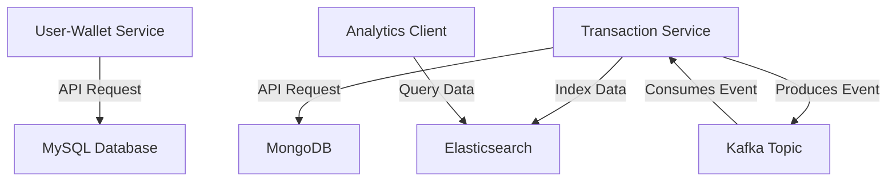

# 💰 Wallet expense management and real time analytics System

A simple yet powerful microservices-based project to manage users, wallets, and transactions — with integrated analytics for tracking expenses and spending behavior.

---

## 🎯 Project Goal

The primary goal of this project is to build a **scalable, decoupled expense management system** using microservices that:
- Manages user accounts and wallets
- Handles transactions securely and reliably
- Performs real-time analytics using Elasticsearch
- Demonstrates event-driven architecture using Kafka

---

## ⚙️ Technology Stack

| Component              | Technology               |
|------------------------|--------------------------|
| ☕ Backend Framework    | Spring Boot (Java 17)    |
| 🔐 Authentication      | JWT (JSON Web Token)     |
| 📦 Messaging Queue     | Apache Kafka             |
| 🧠 Analytics Engine     | Elasticsearch            |
| 💾 User-Wallet Service | MySQL                    |
| 💸 Transaction Service | MongoDB + Elasticsearch  |
| 🐳 Containerization    | Docker & Docker Compose  |

---

## 🧩 Microservices Overview

### 🧍 User-Wallet Microservice
- Handles all user and wallet creation, update, and retrieval
- Stores data in **MySQL**
- Publishes events (e.g., wallet updated) if needed

### 💳 Transaction Microservice
- Records user transactions
- Consumes transaction events from Kafka
- Stores transaction data in **MongoDB**
- Indexes transaction data in **Elasticsearch** for analytics

---

## 🔐 JWT-Based Authentication

Both microservices are secured using **JWT tokens**:
- Tokens are generated on login
- Token validation occurs before accessing protected APIs
- Ensures stateless, scalable authentication

---

## 📊 Architecture Flow Diagram

# Project Status
-----------------
In Progress
- Adding Testing modules
- Adding custom filters and advance analytics

Future Scope
- Budget summary and reports (planned)
- Category expenses